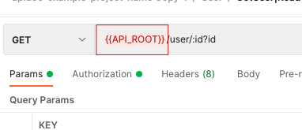

# apidoc2postman


> Use [apiDoc](http://apidocjs.com/) to create a [Postman](https://www.getpostman.com) collection.


This library uses the [apidoc-core](https://github.com/apidoc/apidoc-core) library.

## How It Works
Parsing `apiDoc` inline comments in the source code, export a `postman.json` file which can be imported into the [Postman App](https://www.getpostman.com/apps) to create a new collection.

E.g.

```js
/**
 * @api {GET} /user/id Request User information
 * @apiName GetUser
 * @apiGroup User
 * @apiPermission basic
 *
 * @apiParam {Number} id Users unique ID.
 *
 * @apiSuccess {String} firstname Firstname of the User.
 * @apiSuccess {String} lastname  Lastname of the User.
 */
```

## Installation

`npm install apidoc2postman`

## Features

`apidoc2postman` takes full advantage of [Postman environment variables](https://www.getpostman.com/docs/v6/postman/environments_and_globals/variables) for the following aspects

### CLI usage
```
Usage: apidocPostman [options]

Options:
  -f --file-filters <file-filters>           RegEx-Filter to select files that should be parsed (multiple -f can be used). (default: )
  -e, --exclude-filters <exclude-filters>    RegEx-Filter to select files / dirs that should not be parsed (many -e can be used). (default: )
  -i, --input <input>                        Input/source dirname. (default: )
  -o, --output <output>                      Output dirname. (default: ./doc/)
  -t, --template <template>                  Use template for output files. (default: /Users/ruby/codebase/ruby/apidoc2postman/template/)
  -c, --config <config>                      Path to directory containing config file (apidoc.json). (default: ./)
  -p, --private                              Include private APIs in output.
  -v, --verbose                              Verbose debug output.
  -d, --debug                                Show debug messages.
  -c, --color                                Turn off log color.
  --parse                                    Parse only the files and return the data, no file creation.
  --parse-filters <parse-filters>            Optional user defined filters. Format name=filename (default: )
  --parse-languages <parse-languages>        Optional user defined languages. Format name=filename (default: )
  --parse-parsers <parse-parsers>            Optional user defined parsers. Format name=filename (default: )
  --parse-workers <parse-workers>            Optional user defined workers. Format name=filename (default: )
  -s, --silent                               Turn all output off.
  --simulate                                 Execute but not write any file.
  -m, --markdown [markdown]                  Turn off default markdown parser or set a file to a custom parser. (default: true)
  -l, --line-ending <line-ending>            Turn off autodetect line-ending. Allowed values: LF, CR, CRLF.
  --encoding <encoding>                      Set the encoding of the source code. [utf8]. (default: utf8)
  --sort, --sortby <sortby>                  Api sort by <name|verbs|title> (default: verbs)
  --ef, --export-filename <export-filename>  export postman filename (default: postman)
  -h, --help                                 output usage information
```
### API URL

Default would use the `base_url` environment variable you can specify the base URL of your APIs.

If there is `sampleUrl` in `apidoc.json` or `package.json/apidoc` would replace it into file.

e.g.
```json
{
  "name": "apidoc-example-project-name",
  "version": "0.3.0",
  "description": "apidoc example project",
  "title": "Custom apiDoc browser title",
  "url" : "https://api.github.com/v1",
  // setting url
  "sampleUrl": "{{API_ROOT}}",

  "template": {
  	"withCompare": true,
  	"withGenerator": true
  }
}
```



### Body

`apidoc2postman` will setup `Postman` to use `application/json` body format and will create a template body based on the `apiBody`.

E.g.
```js
/**
 * @apiBody {int} id  operator id
 * @apiBody {string} name operator name
 * @apiBody {int[]} setting operator personal setting
 */
```
will translate to the following template body
```json
{
  "id": 0,
  "name": "string",
  "setting": [0, 1]
}
```

#### Body Parsing Type

😃 Data Type is case insensitive．

| Data Type  | Parsing Value                         |
| ---------- | ------------------------------------- |
| `number`   | `0`                                   |
| `int`      | `0`                                   |
| `integer`  | `0`                                   |
| `float`    | `0`                                   |
| `bit`      | `0`                                   |
| `boolean`  | `false`                               |
| `bool`     | `false`                               |
| `array`    | `[0, 1]`                              |
| `int[]`    | `[0, 1]`                              |
| `date`     | `new Date().toISOString()`            |
| `datetime` | `new Date().toISOString()`            |
| `string`   | `string`                              |
| `string[]` | `['string', 'string']`                |
| `object`   | `{ key: 'value' }`                    |
| `point`    | `{Lat: 'value',Lng: 'value'}`         |
| `object[]` | `[{ key: 'value' },{ key: 'value' }]` |


## Example

`apidoc2postman -i example/ -o doc/`

Have a look at [apiDoc](http://apidocjs.com/#params) for full functionality overview and capabilities of apiDoc.

## Plugin Example

Windows user should use `node` prefix to use module.

Setting input folder by using `-i` or `--input`.
Setting export folder by using `-o` or `--output`.
```
node ./node_modules/apidoc2postman/bin/apidocPostman.js -i ./app -o ./export
```

Setting api sorting by using `--sort` or `--sortby`. (`name`|`verbs`|`title`)
```
node ./node_modules/apidoc2postman/bin/apidocPostman.js -i ./app -o ./export --sort name
```

Setting export file name by using `--ef` or `--export-filename`.
```
node ./node_modules/apidoc2postman/bin/apidocPostman.js -i ./app -o ./export --export-filename myCollection
```

### Base Postman Environment setup

```json
{
  "base_url": "https://localhost:5050"
}
```

## License

[The MIT license](./LICENSE)